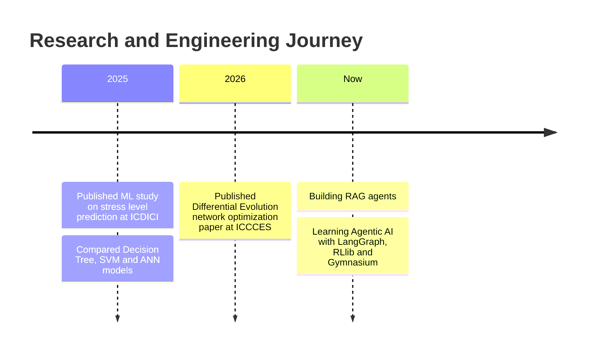
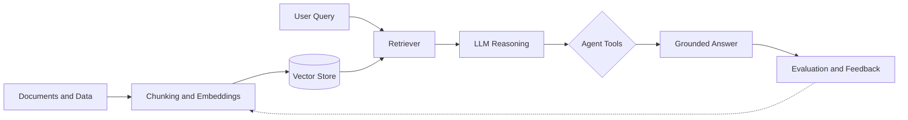

  

 

## 👨‍💻 About Me

I am an ML and AI engineer from India who designs and ships intelligent systems end to end, from data pipelines and model training to retrieval-augmented and agent-based applications ready for production. I also publish my work: two of my research papers are available on IEEE Xplore.

| | |
|:--|:--|
| 🔭 **Currently building** | RAG agents |
| 🌱 **Currently learning** | Agentic AI: LangGraph, RLlib, Gymnasium |
| 🤝 **Open to collaborate on** | AI agents, applied ML, research projects |
| 📫 **Reach me at** | chitreshb376@gmail.com |

 

## 📄 Research & Publications

<table>
<tr>
<td width="50%" valign="top">

### Publication 1

**Predicting Human Stress Levels with Supervised Learning: A Performance-Based Study**
*2025 6th International Conference on Data Intelligence and Cognitive Informatics (ICDICI) · Tirunelveli, India · July 2025*

An ML framework that classifies stress as low, medium or high from heart rate, sleep, screen time, physical activity and caffeine intake. Decision Tree, SVM and ANN models were compared on an 80:20 split, with confusion matrices and 2D/3D visualizations.

`Machine Learning` `Healthcare AI` `SVM` `Neural Networks`

</td>
<td width="50%" valign="top">

### Publication 2

<!-- TODO: replace this working title with the exact title shown on IEEE Xplore -->
**Differential Evolution-Based Resource Optimization for Computer Networks**
*2026 5th International Conference on Communication, Computing and Electronics Systems (ICCCES) · Coimbatore, India · January 2026*

A Differential Evolution model, simulated in MATLAB, that balances bandwidth, CPU, memory, power and buffer allocation to maximize throughput and minimize operational cost using mutation, crossover and selection.

`Optimization` `Differential Evolution` `MATLAB` `Computer Networks`

</td>
</tr>
</table>

 

## 🚀 Journey

 

## 🧩 RAG Agent Architecture

<b>How the pipeline works (click to expand)</b>

 

1. **Ingest:** documents are cleaned, chunked and converted into embeddings.
2. **Retrieve:** the user query is matched against the vector store to fetch the most relevant context.
3. **Reason:** an LLM agent decides whether to answer directly or call tools using the retrieved context.
4. **Evaluate:** answers are scored for grounding and quality, and the feedback improves retrieval and chunking.

 

## 🛠️ Tech Stack

**🧠 AI / Machine Learning** 
 

**📊 Data Science** 
 

**💻 Languages** 

**⚙️ Backend & APIs** 
 

**🎨 Frontend** 

**🗄️ Databases** 

**☁️ Cloud & DevOps** 

**✏️ Design** 

 

## 📊 GitHub Analytics

 

## 🤝 Let's Connect

I am always happy to talk about AI agents, applied machine learning and research collaborations.

